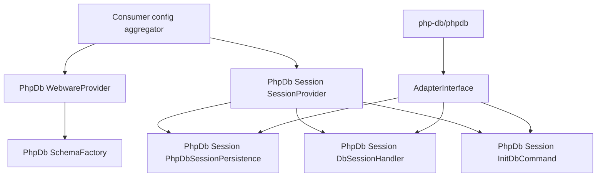

# webware/webware-phpdb

PhpDb bridge for the Webware stack. This package declares the `PhpDb` root namespace against its
own `src/`, so Webware packages can replace or extend individual `php-db/phpdb` classes without
forking the library.

## The shadow

`php-db/phpdb` maps `PhpDb` to its own `src/`. This package declares the same prefix against its
own `src/`, and Composer registers PSR-4 directories in dependency order. The generated autoload
map shows the result:

```php
// vendor/composer/autoload_psr4.php
'PhpDb\\' => array($baseDir . '/src', $vendorDir . '/php-db/phpdb/src'),
```

This package's `src/` is consulted first for every `PhpDb` class:

| Class | Resolves to |
|---|---|
| A class defined here | This package's copy, which replaces the `php-db/phpdb` class of the same name |
| Any class not defined here | `php-db/phpdb`, unchanged |

`php-db/phpdb` is a hard `require` of this package. Without it there is nothing to shadow.

One name must not be repeated: a second `PhpDb\ConfigProvider` would be an ambiguous class
resolution for Composer's optimized autoloader. This package's root provider is therefore
`PhpDb\WebwareProvider`, and its session provider is `PhpDb\Session\SessionProvider`. `php-db/phpdb`
keeps `PhpDb\ConfigProvider`; both load, and a consumer that merges this package's providers after
it layers the bridge wiring on top.

## What ships

| Namespace | Contents |
|---|---|
| `PhpDb` | `SchemaInterface`, `SchemaFactory`, `WebwareProvider` |
| `PhpDb\Container` | `SchemaFactoryFactory` |
| `PhpDb\Session` | `PhpDbSessionPersistence`, `DbSessionHandler`, `SessionPayload`, `IniDefaults`, `SessionTable`, `Sql\Insert`, `SessionProvider` |
| `PhpDb\Session\Console` | `InitDbCommand`, `Schema\SessionSchema`, `Ddl\Column\MediumText`, `Container\InitDbCommandFactory` |
| `PhpDb\TableGateway\Feature` | `EventDispatcherFeature`, `EventDispatcher\TableGatewayEvent` |



## Documentation

| Page | Covers |
|---|---|
| [installation.md](installation.md) | Requirements, install, provider registration |
| [schema-factory.md](schema-factory.md) | `SchemaInterface`, `SchemaFactory`, identifier precedence |
| [session.md](session.md) | Database session persistence, the `session:init-db` command, its table |
| [event-dispatcher.md](event-dispatcher.md) | The PSR-14 table gateway event feature |
| [development.md](development.md) | Gates, tooling, tests, local database |
